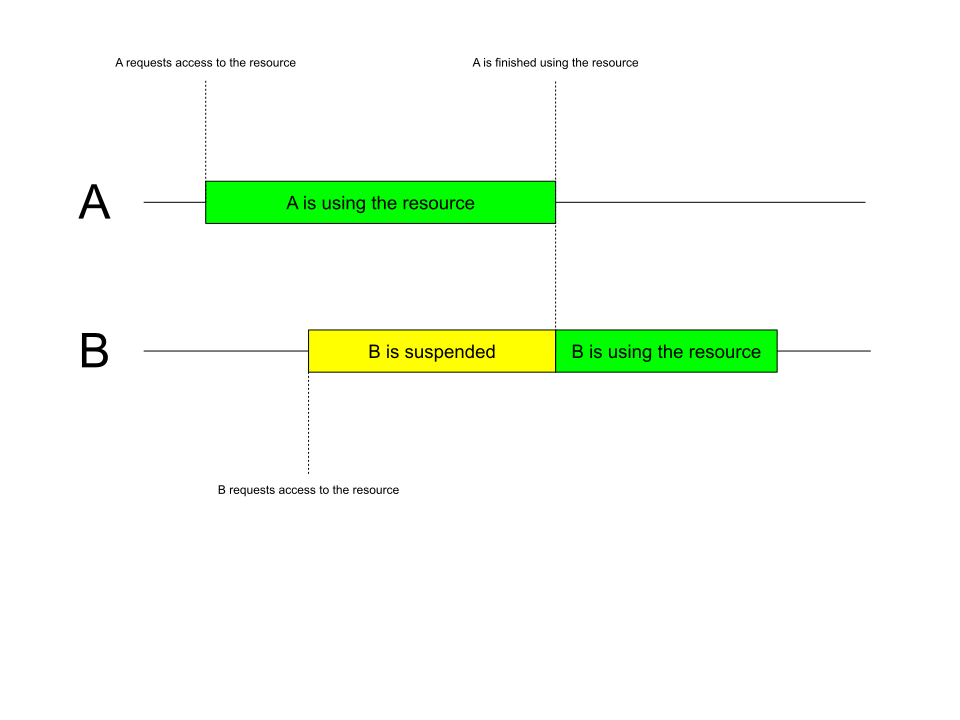

# SourceLock

SourceLock is a Kotlin library that manages synchronous access 
to shared resources from different coroutines through a queue
system.

## Example

```kotlin
import io.github.rk012.sourcelock.ResourceDescriptor
import kotlinx.coroutines.*

val r = ResourceDescriptor("Modified by:")

suspend fun coroutineA() {
    println("A: Requesting resource")
    r.open {
        println("A: Got resource")
        delay(500) // Some expensive computation
        it.content += " A"
        println("A: Finished using resource")
    }
}

suspend fun coroutineB() {
    println("B: Requesting resource")
    r.open {
        println("B: Got resource")
        delay(500) // Some expensive computation
        it.content += " B"
        println("B: Finished using resource")
    }
}

fun main() = runBlocking {
    r.open {
        println("Initial value: '${it.content}'")
    }

    // Wait until all coroutines are finished
    coroutineScope {
        launch { coroutineA() }
        delay(100)
        launch { coroutineB() }
    }

    r.open {
        println("Final value: '${it.content}'")
    }
}
```

Result:

```
Initial value: 'Modified by:'
A: Requesting resource
A: Got resource
B: Requesting resource
A: Finished using resource
B: Got resource
B: Finished using resource
Final value: 'Modified by: A B'
```

### Explanation
While coroutineA was using the resource, coroutineB requested it.
coroutineB was suspended until coroutineA finished using the resource.
When coroutineA finished, the resource was released and coroutineB
could use it.

The entire process can be visualized by the following diagram:


